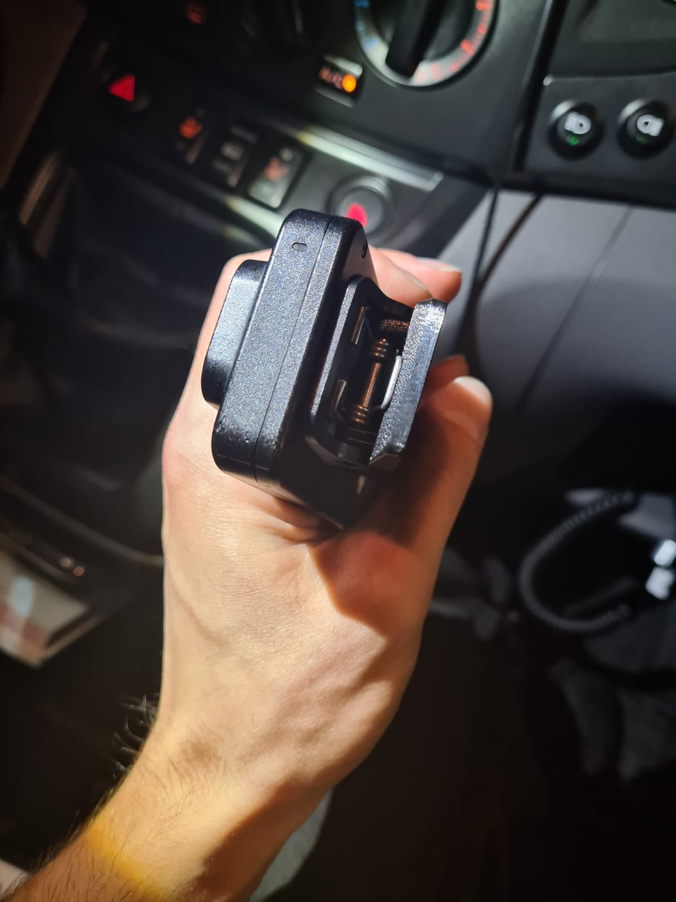

# Camera clip

This repository represents a project to create part of an older camera mount (Camera Transcend DrivePro Body 20 or some olders models of camera).
This part often broke, and the original ceased to be supplied.
The solution using a 3D model printed on a 3D printer is directly suitable for this purpose.

A fully parameterized model was created.

Parameterization schema are sketch and stored in folder `parameters_schema`.
Using these parameters stored in `parameters_schema`,
it is possible to modify the model almost arbitrarily.
The finished result with one specific parameterization
can be seen in `result_img`.

<!---
 
-->

## License
This project is licensed under the **MIT**.
